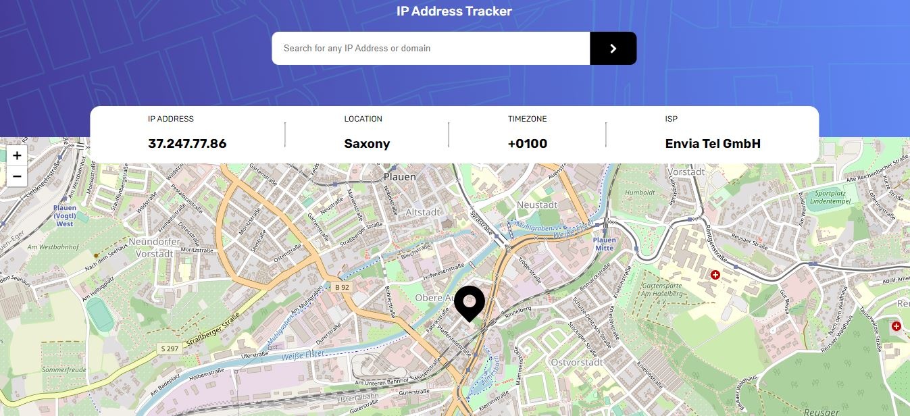

# Frontend Mentor - IP address tracker solution

This is a solution to the [IP address tracker challenge on Frontend Mentor](https://www.frontendmentor.io/challenges/ip-address-tracker-I8-0yYAH0). Frontend Mentor challenges help you improve your coding skills by building realistic projects. 

## Table of contents

- [Overview](#overview)
  - [The challenge](#the-challenge)
  - [Screenshot](#screenshot)
  - [Links](#links)
- [My process](#my-process)
  - [Built with](#built-with)
  - [Useful resources](#useful-resources)
- [Author](#author)

## Overview

### The challenge

Users should be able to:

- View the optimal layout for each page depending on their device's screen size
- See hover states for all interactive elements on the page
- See their own IP address on the map on the initial page load
- Search for any IP addresses or domains and see the key information and location

### Screenshot

### Links

- Live Site URL: (https://tabetommy.github.io/ip-address-tracker/)

## My process

### Built with

- Flexbox
- CSS Grid
- Mobile-first workflow
- [ipapi](https://ipapi.co/) - IP address api
- [React Leaflet](https://react-leaflet.js.org/)
- [React](https://reactjs.org/) - JS library

## Author

- Website - [Tommy Tabe]
- Frontend Mentor - [@Tommy Tabe](https://www.frontendmentor.io/profile/tabetommy)
- Linkedin - [@Tommy Egbe](https://www.linkedin.com/in/tommy-egbe-304464116/)

